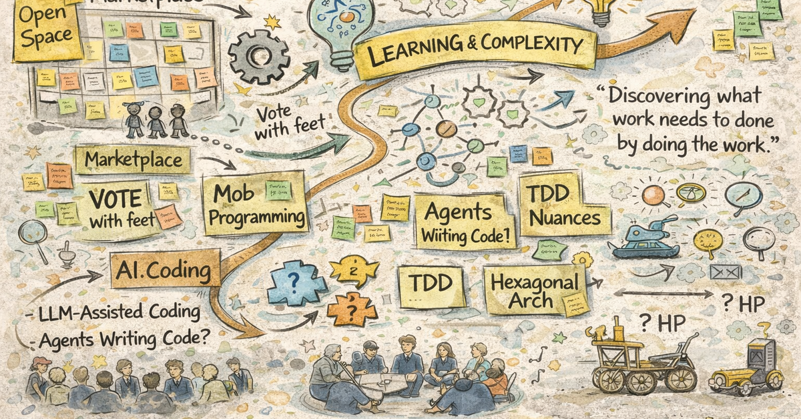

I recently attended my 3rd Software Crafters UnConference — an open space event where practitioners self-organize around the topics they actually care about. No vendor keynotes. No polished decks. Just honest conversation about the work.

Here's what stayed with me.

*Image: AI-generated by ChatGPT (GPT-4o / OpenAI), February 2026.*

## The Big Theme: Same Game, New Tools

The through-line of the day, for me, was this: Dave Farley's frame still holds — the game is still to optimize for learning and complexity. But the complexity is moving. As AI changes the cost, complexity, and risk of software development, we are inventing (or discovering) new places to add them back. AI isn't giving us the same software differently, it is differently giving us different software.

As AI generates programming language and config files for (what's approaching) no cost, those artifacts are no longer the "source files". They are ephemeral artifacts derived from other "source of truth" files (or non-file sources of truth). As Woody Zuill says, "We are discovering what work needs to be done by doing the work" with these new thingies: agents, skills, orchestrators, context.

We are metaphorically marveling that our 1-horse carriage is powered by a 10 horsepower motor, but we don't (can't?) yet imagine snowmobiles, ski boats, and stump grinders. Or oil changes.

## Sessions

The marketplace was rich. Five session slots, multiple rooms running in parallel, with participants voting with their feet. A sampling of what was on offer:

### AI and Practice

- *Co-evolving Practices with LLM-assisted Coding* — how do our existing practices need to adapt (or not)?
- *When Agents Write All Your Code, What Do We Rethink?* — TDD, duplication, design in an agentic world
- *Don't Tell Me "You're Holding It Wrong" — XP Practices with Agentic AI*
- *Defense Against the Dark AI Arts* — the risks we don't talk about enough
- *Interaction Patterns for Effective AI-Augmented Dev*

### Enduring Craft

- *TDD Nuances — What Should Folks Know That They Don't?*
- *Hexagonal / Ports & Adapters Architecture — Why Are We Doing Anything Else?*
- *Event Sourcing: Projections, Processors, Dynamic Consistency Boundaries*
- *A Healthy Approach to Observability — Ending the Noise, Minding the Signal*

### People and Teams

- *Mob Programming with AI* — and *Put Down Your Pitchforks! Mob Programming is Dead* (these two made for interesting contrast)
- *Teaming and AI — Thinking Together with AI* (Woody Zuill and James Herr)
- *What Do You Want from Your Manager?*
- *Neuro-Spicy at Work*
- *Mentoring Without Becoming the Bottleneck*
- *Through Struggle Comes Growth — AI Robbing Next-Gen Career Building Blocks*

### Perspective Checks

- *Thoughts on (Modern?) Software Development — "The Current Hype of AI"* — a well-sourced counterweight to enthusiasm
- *What Are Some Daily Habits / Practices You're Glad You Started?*
- *Let's Celebrate Our Wins*

## Why UnConferences Still Matter

Low polish, high value. That's the format working as intended.

There's something irreplaceable about a room where the agenda is built by the people in it — where sessions form around genuine curiosity rather than a speaker submission deadline, and where the best conversations often happen between slots rather than during them.

If they were giving awards, I'd give Garrick West the "Agile Curmudgeon" award — for boldly modeling both attributes:

The curmudgeon part (at opening circle): "I don't want to pay for an AI to parse 'Please' and 'Thank you.' In fact, I want it to teach me how to treat it non-anthropomorphically."

The agile part (at closing circle): "Uncle. I learned I was not asking the right question."

That's the magic, actually: Skepticism + Curiosity.  Being critical of ideas until they're proven, and remaining genuinely open to updating.  Rare as separate attribute. Thanks, Garrick, for openly modeling both.

---

*The [Software Crafters Unconference](https://scunconf.com/) runs periodically as an open space for practitioners who care about doing the work well. Worth following if you haven't yet.*
