# GenAI Day #7 -- The Rise of Agentic AI

## Details

- Title: GenAI Day: The Rise of Agentic AI
- URL: <https://www.softed.com/may-2026-genai-day>
- Date: 2026-05-14, 11:00 AM - 5:00 PM EDT
- Format: Live on Zoom
- Zoom: <https://zoom.us/j/3610029261?pwd=6WYYsYJ82AEUTdhuXxG4OE5TOcJni6.1>
- Meeting ID: 361 002 9261
- Contact: <info-us@softed.com> / 1-800-373-7028
- Post-event: recordings, slides, full transcripts, and chat logs sent to all registrants
- Tip from SoftEd: share your LinkedIn URL in the Zoom chat

## People

See [people.vcf](people.vcf) for importable contact cards (vCard 3.0, all 13 speakers). Per-person details (LinkedIn, title, company, notes) are in each session's entry below.

## Sessions

See [event.ics](event.ics) for importable calendar events (12 sessions + full-day block, TZID=America/New_York).

### S01 11:00 - David Mantica & Lara Hill

- Session: Opening Keynote: Leading in the Age of AI Agents
- Title: Managing Director, SoftEd
- LinkedIn: [David Mantica](https://www.linkedin.com/in/david-mantica/)
- Bio: <https://www.softed.com/us/about-us/our-team/david-mantica/>
- Note: Repeat speaker: GenAI Days #4, #5, #7. LinkedIn URL not yet in Contacts.app card -- add after import.

- Session: Opening Keynote: Leading in the Age of AI Agents
- Title: Facilitator, Skills Development Group
- LinkedIn: [Lara Hill](https://www.linkedin.com/in/larahill/)
- Company: [Skills Development Group](https://skillsdg.com/)
- Note: Repeat: GenAI Day #5. Co-facilitator; listed in registration emails alongside David Mantica. Not on public speaker page.

``` text
Opening Keynote: Leading in the Age of AI Agents 

The leadership playbook is being rewritten. With Gartner predicting that 80% of project management tasks will be AI-driven by 2030..." David examines what works in enterprise AI adoption and leadership capabilities separating successful scaling from pilot stagnation.
```

#### S01 11:00 - David Mantica & Lara Hill - Notes

- 2022 through now - 80,000 tech layoffs
- By mid 2020s, 80% of project management will be done by AI

Old - SHOULD we do AI?
Now - HOW FAST should we do AI?

> A fool with a tool
> is still a fool.
> -- Grady Booch

Gaps - All stalling tactis

- capability gap
- no use case
- leadership avoidance

New leadership skills

- Adaptive Leadership
- Critical thinking
- self-awareness

#### S01 11:00 - David Mantica & Lara Hill - Follow-up

1. TY (w/ Lara) for event
2. Self-awareness -- Connect to Wendy
3. Reserch Amy Rice - Co-intelligence

Quotes:

> 1. Get on the balcony.  (To view the landscape
>
> 2. Protect dissent

---

### S02 11:30 - Jess Wolfe

- Session: Stop Using a Sledgehammer: Matching AI Autonomy to the Task at Hand
- Title: Customer Success Manager, Swarmia
- LinkedIn: [Jess Wolfe](https://www.linkedin.com/in/thejessicawolfe/)
- Company: [Swarmia](https://www.swarmia.com/)

``` text
Stop Using a Sledgehammer: Matching AI Autonomy to the Task at Hand

Jess introduces the "Five Levels of AI Autonomy" framework, clarifying when conversational AI versus task agents suit particular organizational problems and workflows.
```

#### S02 11:30 - Jess Wolfe - Notes

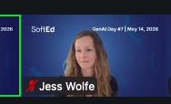
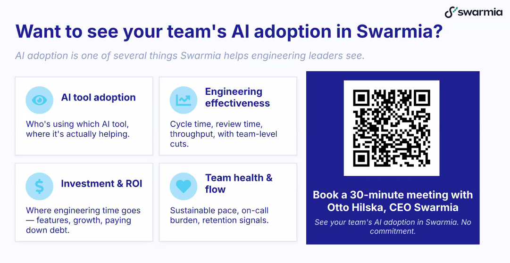

5 levels of AI Autonomy
L1 - Assist (auto compleat)
L2 - Conversational
L3 - Task Agent
L4 - Autonomous
L5 - Agentic Avalanch

Tool/Task does not choose level.  Human does.

Most teams plateau around Level 2.

Higher is not Better

Refrains

> Do you have a clear Definition of Done?
> DoD is Definition of "Ready for AI"

Many interactive examples to test audience comprehension.  Show, don't tell.

#### S02 11:30 - Jess Wolfe - Follow-up

- [ ] Send [LinkedIn connection request](https://www.linkedin.com/in/thejessicawolfe/)

  > You packed a lot of great material into your GenAI session, but what impressed me most is that you engaged folks with the L1-L5 examples. Well done. Would love to stay connected. Thanks for CEO connection invitation.

- [ ] [Book 30-minute session with CEO (Otto Hilska)](https://link.swarmia.com/meetings/otto-hilska/partner?utm_campaign=genai-day-2026&uuid=e386f05c-bbde-4e0f-b2ed-01045c21cdaa)
- [ ] Book 30-minute session with Jess

---

### S03 11:50 - Alan Knox

- Session: Scaling AI Agents Without Losing Control: AI Proposes, Systems Decide
- Title: COO, CtiPath
- LinkedIn: [Alan Knox](https://www.linkedin.com/in/alanknox/)
- Website: <https://alanknox.com/>
- Email: <info@alanknox.com>
- Note: Event page lists him as VP Product Development, QuantaViable -- no public web presence found. Verify with him directly.

``` text
Scaling AI Agents Without Losing Control: AI Proposes, Systems Decide

Alan introduces governed autonomy architecture where "AI handles reasoning while deterministic systems control progression, escalation, and oversight," demonstrating real-world implementation.
```

#### S03 11:50 - Alan Knox - Notes

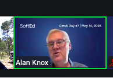
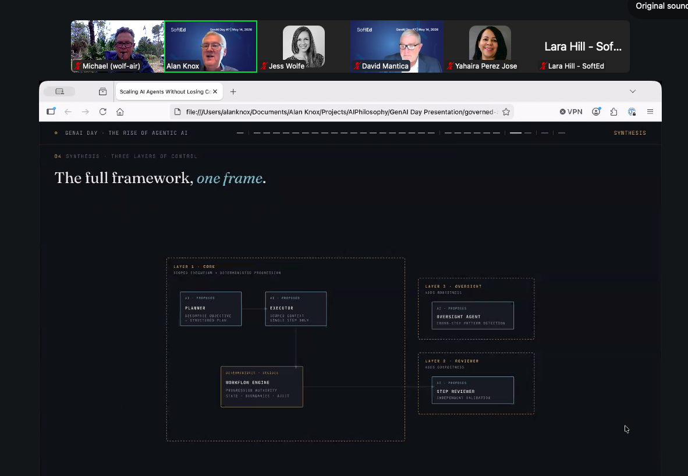
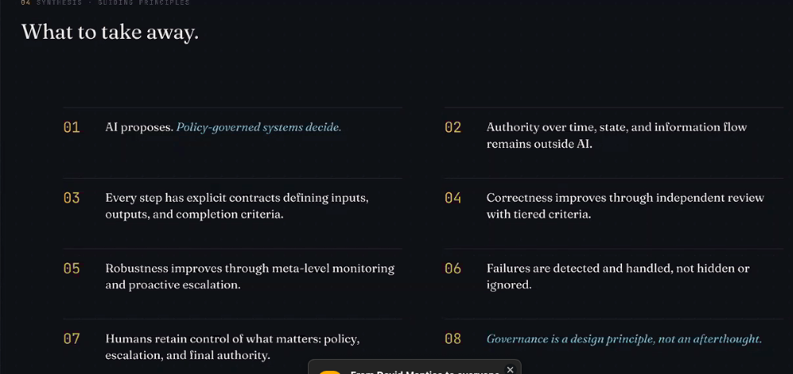
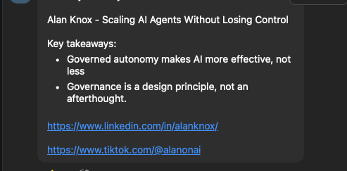

Son is paramedic.  Extended use of simile to AI Agents.  Well done.

- protocols
- Assistance
- Autonomous
- Controls

Autonomy when needed
Governance always

FTO - Field Training Officer
APP - Advanced Practice Paramedic - Oversight Agents

Level 1

- Planner
- Executioner
- Workflow Engine

Level 2

- Step Reviewer

Level 3

  -Oversight Agent

Q: Who owns decision?
A: CTO (or person) always owns cecision!

1. AI Proposes
1. Authority is human
1. Contracts
1. Review improves correctness
1. Robustness proportional meta level
1. Expose failures
1. Humans control important parts
1. Governance is design, NOT afterthought

Celia Moore had good HR question.

#### S03 11:50 - Alan Knox - Follow-up

- [ ] Suggest "Thinking Fast and Slow" to Alan
- [ ] Connect  Willem Larsen to Alan
- [ ] LI Connection Request - Alan

> I appreciate the two parallel systems (paramedics and AI Agents) in you GenAI Day #7 talk.  Having 2 domains was very helpful to triangulate the roles.  I'd love to stay connected -- on LinkedIn, and even a call if you would like that.

- [ ] LI Connection Request - Celia

> At GenAI Day, your question in Alan's session named the thing most technical frameworks skip -- the human side that balances autonomy and governance.  Would love to stay connected.
  
---

### S04 12:20 - Dev Panajkar & Prasad Banala

- Session: Elevating SRE Observability using AI
- Title: CIO, XClaymation
- LinkedIn: [Dev Panajkar](https://www.linkedin.com/in/devpanajkar/)
- Company: [XClaymation](https://xclaymation.com/)

- Session: Elevating SRE Observability using AI
- Title: Director of Quality, Performance & SRE, Major Retail Company
- LinkedIn: [Prasad Banala](https://www.linkedin.com/in/prasad-banala-5686a716/)
- Note: Employer withheld per event page.

``` text
Elevating SRE Observability using AI

Dev and Prasad explore how GenAI transforms SRE, demonstrating "how AI-powered observability adds context, reduces noise, and connects system behavior to customer impact."
```

#### S04 12:20 - Dev Panajkar & Prasad Banala - Notes

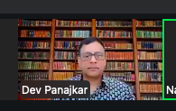
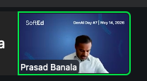
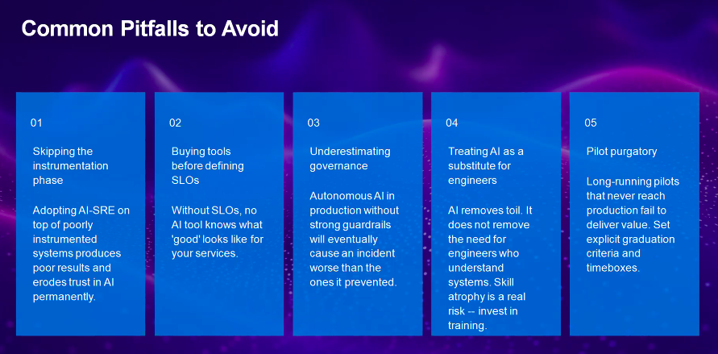

#### S04 12:20 - Dev Panajkar & Prasad Banala - Follow-up

Tata!  No follow-up.

---

### S05 12:40 - Toby Rao

- Session: Beyond the Pilot: Bringing AI to Life Across the Organization
- Title: Founder, Loudoun AiGile Network
- LinkedIn: [Toby Rao](https://www.linkedin.com/in/tobyrao/)
- Note: Also Director of Enterprise Transformation & AI COE Lead at Exostar (day job).

``` text
Beyond the Pilot: Bringing AI to Life Across the Organization

Toby walks through six moves separating organizations scaling AI from those stalling, sharing how a transformation achieved "58% adoption, a 69% productivity gain, and 93% engagement in nine months."
```

#### S05 12:40 - Toby Rao - Notes

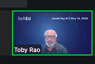
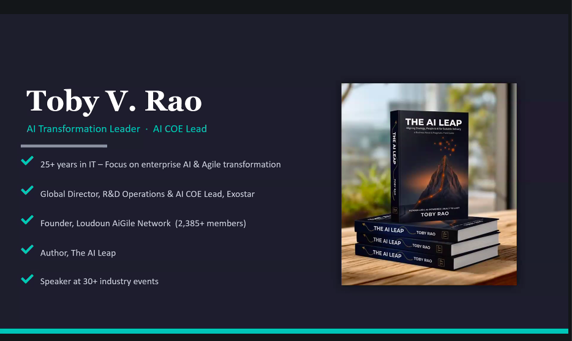
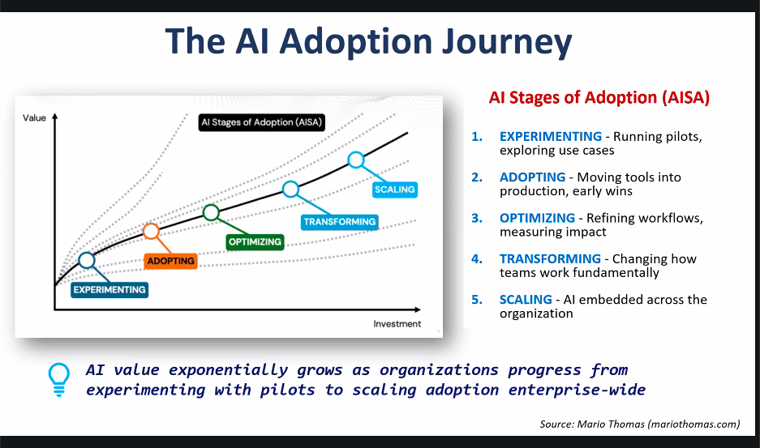
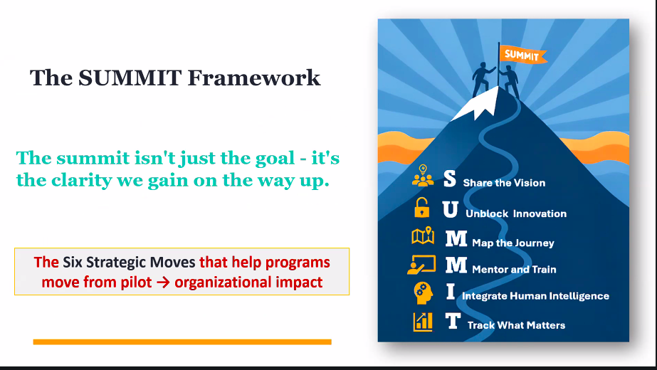

#### S05 12:40 - Toby Rao - Follow-up

Toby is the Founder of a 2,300+ member Agile + AI community. This is Michael's intersection.
Ask about the network itself, not the case study. What kinds of practitioners are in it? Is there space for someone who does team-level AI adoption work?

**In-session or at break:** "Toby -- the Agile + AI intersection is exactly where I work. I'd love to learn more about the Loudoun AiGile Network. Is it open to practitioners doing hands-on adoption work with teams?"

Rough follow-up draft:

> "Toby -- the case study landed for me. The 58% number is the kind of evidence most orgs need before they'll move. I work at exactly that intersection of Agile and AI adoption -- helping teams close the gap between 'deployed' and 'trusted.' Is the Loudoun AiGile Network a place where that kind of practitioner work fits? I'd welcome a conversation."

---

### S06 1:15 - Jordan Plawner

- Session: Meaning and Purpose in the Age of AI: Making AI Human
- Title: Founder, Pacific AI Advisory
- LinkedIn: [Jordan Plawner](https://www.linkedin.com/in/jordan-plawner/)
- Company: [Pacific AI Advisory](https://www.pacificaiadvisory.com/)

``` text
Meaning and Purpose in the Age of AI: Making AI Human

Jordan helps professionals understand contemporary AI capabilities and limitations, guiding audiences through an inner loop of change -- mindset, skills, everyday use -- that "turns uncertainty into agency and frees time for more meaningful work."
```

#### S06 1:15 - Jordan Plawner - Notes

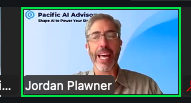
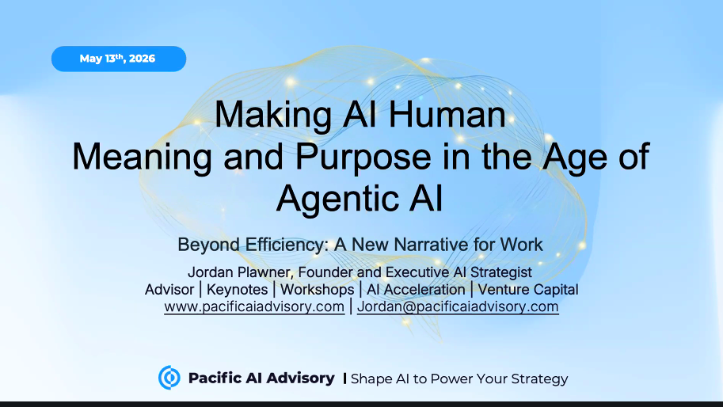
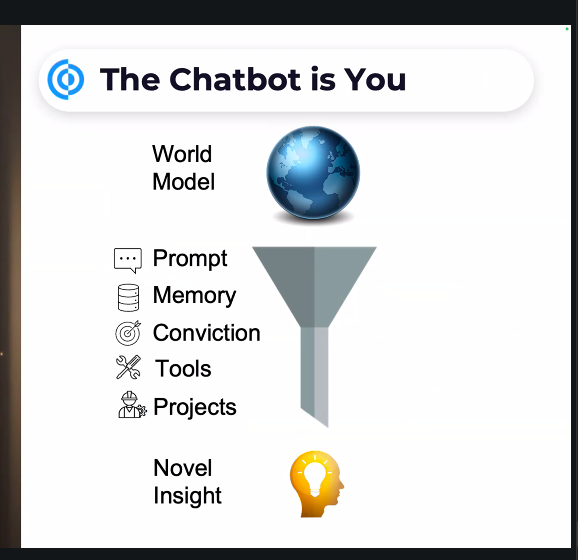
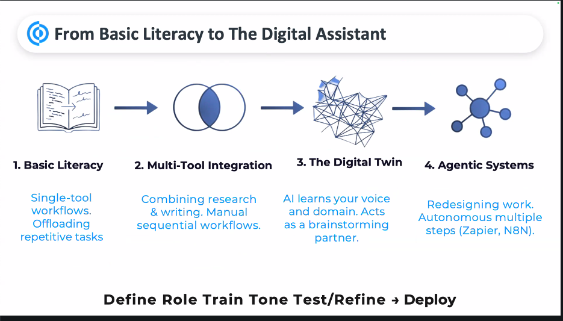
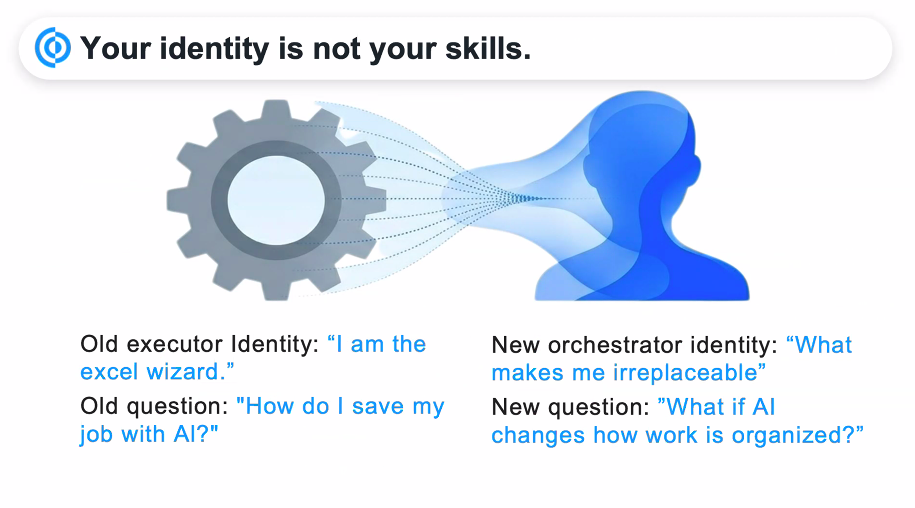
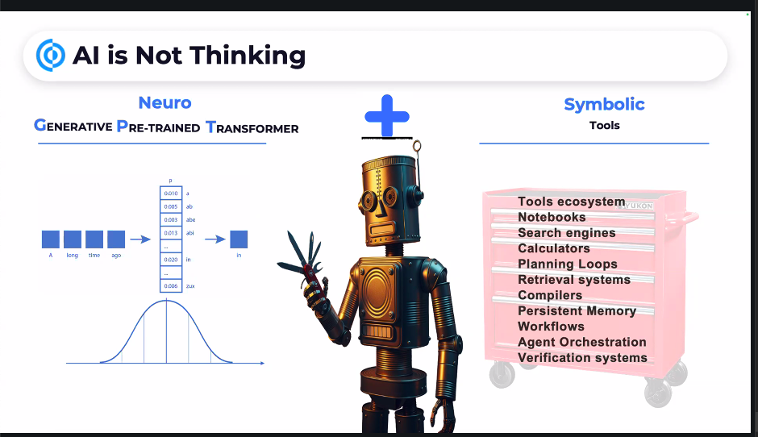
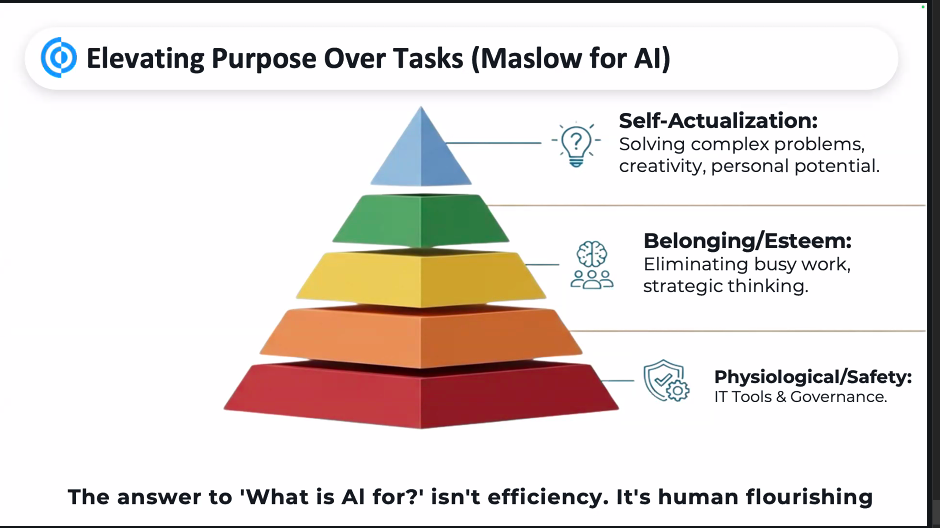
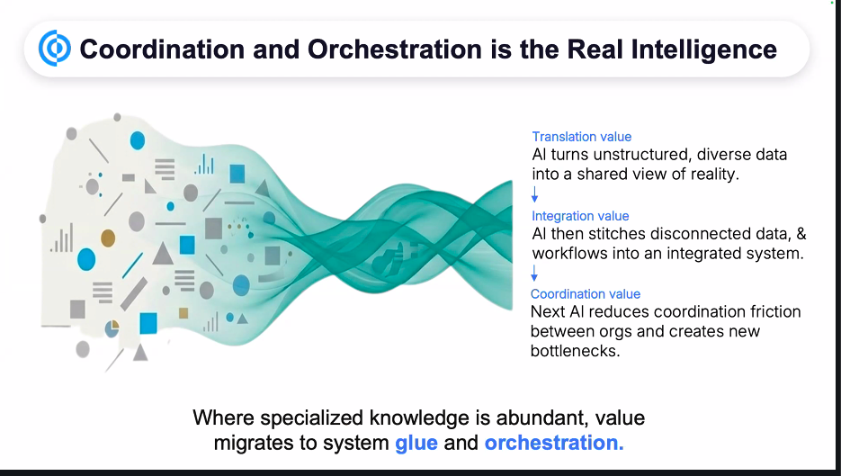

#### S06 1:15 - Jordan Plawner - Follow-up

Jordan is running an AI advisory firm targeting mid-size orgs and Fortune 500. Advisory firms need implementation muscle for the ground-level work they can't do from a boardroom.

**In-session or at break:** "Jordan -- I've been doing something adjacent to your work: using mob programming as an AI adoption tool. Teams learn faster working together with AI in the loop than in any training session. Curious whether that kind of implementation layer fits into your practice."

Rough follow-up draft:

> "Jordan -- your framing of 'uncertainty into agency' resonated. I've been working on exactly that transition, but from the inside of teams rather than from the advisory layer. Mob programming with AI in the loop accelerates the shift from fear to fluency faster than any workshop I've seen. Curious whether Pacific AI Advisory ever needs an implementation partner for the hands-on phase. Would welcome a conversation."

---

### S07 1:35 - Jenny Larsson

- Session: The Moves That Matter: A Practitioner's Guide to Joining the 39%
- Title: AI & Digital Transformation Executive (independent)
- LinkedIn: [Jenny Larsson](https://www.linkedin.com/in/jlarsson/)
- Note: Actual employer is Intact Insurance Specialty Solutions (Global CIO). Multiple LinkedIn matches -- confirmed via event page.

``` text
The Moves That Matter: A Practitioner's Guide to Joining the 39%

Jenny shares real deployments and obstacles from regulated industries, covering "what the research confirms, and what you can do differently starting next week."
```

#### S07 1:35 - Jenny Larsson - Notes

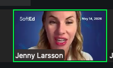
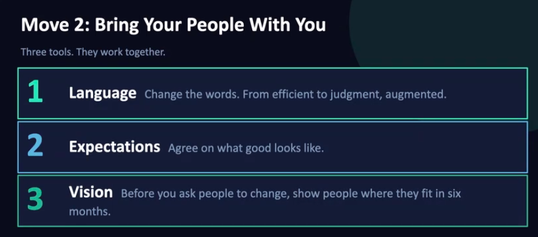
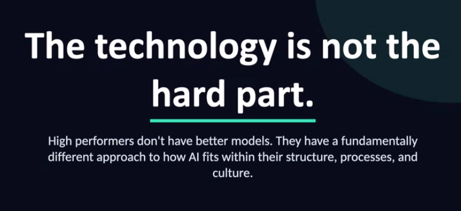
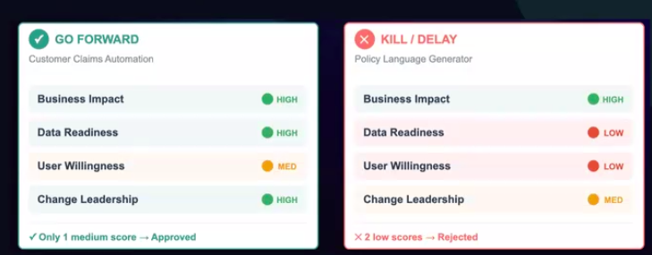

#### S07 1:35 - Jenny Larsson - Follow-up

---

### S08 2:15 - George Churchwell

- Session: Building Custom AI Agents: A Hands-On Guide to Purpose-Built GPTs
- Title: Director GenAI Solutions, Mt. Tam Innovations LLC
- LinkedIn: [George Churchwell](https://www.linkedin.com/in/george-churchwell-6a6a)
- Bio: <https://www.thinkmti.com/team>
- Phone: +1-571-250-5938
- Note: Repeat speaker: GenAI Days #4, #5, #7. Duplicate card in Contacts.app -- Daylite will merge.

``` text
Building Custom AI Agents: A Hands-On Guide to Purpose-Built GPTs

George shares methodology for constructing purpose-built GPTs tailored to specific workflows, covering "practical prompt engineering patterns, how to design AI tools that your team will actually use, and the architectural decisions that determine whether a custom agent becomes essential infrastructure or just another tool gathering digital dust."
```

#### S08 2:15 - George Churchwell - Notes

#### S08 2:15 - George Churchwell - Follow-up

George keeps showing up at these events. That's signal. Three events is a pattern worth naming.

**In-session or after:** "George -- I keep running into you at these things. That's probably a sign we should actually talk. What are you working on right now that's most interesting?"

This is a relationship opener, not a pitch. Let the conversation develop.

Rough follow-up draft:

> "George -- three GenAI Days and we keep finding each other. I'd like to actually talk. I work in the space where your 'digital dust' problem lives -- helping teams build the adoption habits that make custom agents stick rather than stall. Coffee or a call sometime this week?"

---

### S09 2:35 - Corey King

- Session: Stop Automating the Mess: A Lean Case for AI That Actually Works
- Title: Owner & Principal, Black Flak LLC
- LinkedIn: [Corey King](https://www.linkedin.com/in/king-corey/)
- Website: <https://www.blackflak.org/>

``` text
Stop Automating the Mess: A Lean Case for AI That Actually Works

Corey argues for applying "Lean Six Sigma principles, including value stream mapping, waste identification, and disciplined prioritization, before deploying AI."
```

#### S09 2:35 - Corey King - Notes

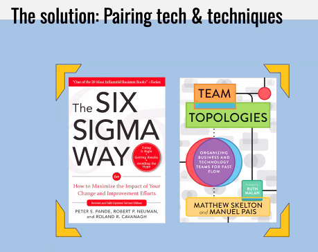
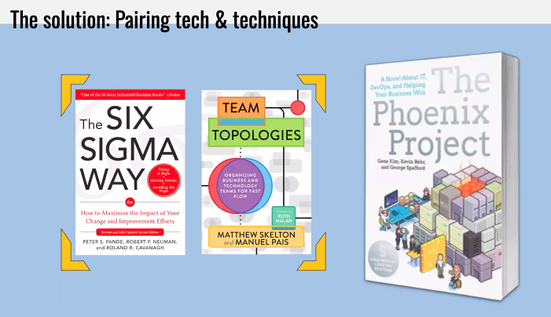

#### S09 2:35 - Corey King - Follow-up

---

### S10 3:00 - Tony Rockliff

- Session: AI for Everyone: Practical Tools That Transform How You Work Today
- Title: Founder, AI Connection Club
- LinkedIn: [Tony Rockliff](https://www.linkedin.com/in/tonyrockliff/)
- Bio: <https://tonyrockliff.com/about-tony/>
- Company: [AI Connection Club](https://aiconnectionclub.com/)

``` text
AI for Everyone: Practical Tools That Transform How You Work Today

Tony demonstrates practical AI tools and techniques available currently, offering "live demonstrations of real workflows and leave with a curated toolkit you can start using immediately, regardless of your technical background."
```

#### S10 3:00 - Tony Rockliff - Notes

#### S10 3:00 - Tony Rockliff - Follow-up

Tony's entire brand is connecting people in AI. His community has 2,300+ members. He runs 10+ seminars monthly. He is literally in the business of connecting people.

**Tell him what you do. Ask who he thinks you should know.**

**In-session or break:** "Tony -- I help technical teams adopt AI at the team level, using mob programming as the learning vehicle. Who in the AI Connection Club community do you think I should meet?"

Rough follow-up draft:

> "Tony -- I appreciate the curation. That's exactly the gap you're filling. I work on the adjacent problem: once someone knows they want to use AI, how do they actually build the muscle with their team? Mob programming with AI in the loop is my answer. I'd love to know who in the AI Connection Club community is tackling team-level adoption -- and whether there's a fit. Up for a quick call?"

---

### S11 3:30 - Stacy Gonyou

- Session: The 90-Day Pod: A Framework for Embedding AI Without Losing the Organization
- Title: Director of AI Strategy & Solutions, IntePros
- LinkedIn: [Stacy Gonyou](https://www.linkedin.com/in/stacygonyou/)
- Company: [IntePros](https://intepros.com/)
- Note: IntePros is a staffing/consulting firm -- **direct paid-work connection**.

``` text
The 90-Day Pod: A Framework for Embedding AI Without Losing the Organization

Stacy covers practical methodology for establishing forward-deployed pods, running time-boxed engagements, and executing sustainable handoffs without creating organizational dependency.
```

#### S11 3:30 - Stacy Gonyou - Notes

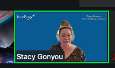
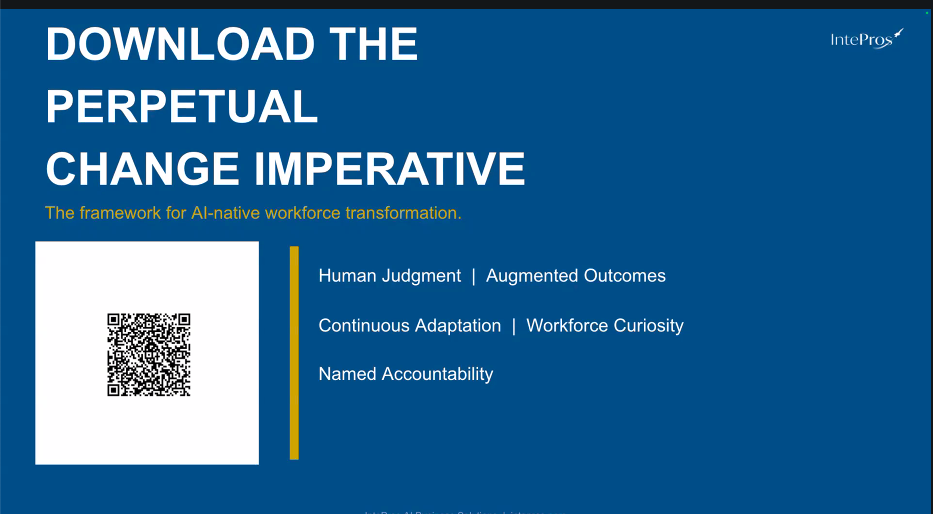
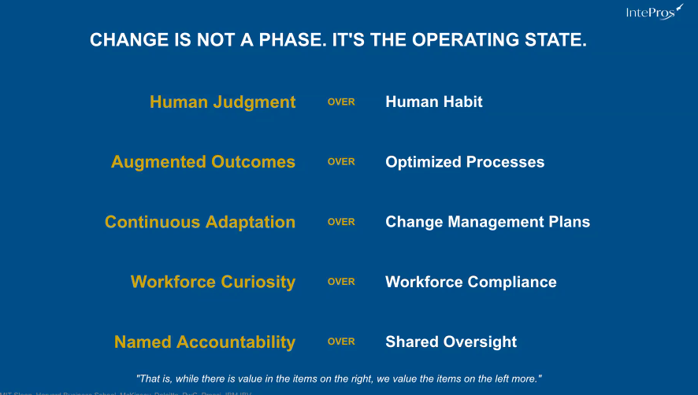

#### S11 3:30 - Stacy Gonyou - Follow-up

Stacy is at IntePros, a staffing and consulting firm that places people in tech roles. She is describing an engagement model (the 90-Day Pod) that is exactly the shape of work Michael does.

**This is the most direct paid-work path in the room.**

**After her session:** "Stacy -- the 90-Day Pod model is exactly the shape of engagement I do. Embedded, time-boxed, focused on knowledge transfer rather than dependency. I'd love to talk about whether there's a fit with what IntePros does. Is there a good way to connect after today?"

Do not over-explain. One sentence about overlap. One ask. Stop talking.

Rough follow-up draft:

> "Stacy -- I appreciated your session today. The 90-Day Pod model resonated because it describes how I work: embedded with the team, time-boxed engagement, sustainable handoff. I bring that approach specifically to AI adoption with technical teams. I'd welcome a conversation about whether IntePros ever places practitioners like me. Available for a 20-minute call this week?"

---

### S12 4:00 - Zaki Medina

- Session: Closing Session: Agentic AI isn't magic. It's a stack.
- Title: CTO, REVIVE Healthcare Group
- LinkedIn: [Zaki Medina](https://www.linkedin.com/in/zakimedina/)
- Note: Repeat speaker: GenAI Days #5, #7

``` text
Closing Session: Agentic AI isn't magic. It's a stack.

Zaki examines the agent stack's six layers, maturity curves, and commoditization trajectories, providing "a five-step Monday-morning action list you can run before lunch."
```

#### S12 4:00 - Zaki Medina - Notes

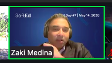
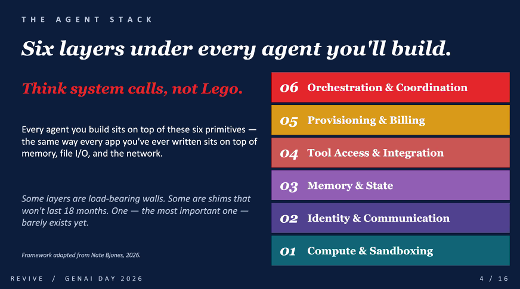
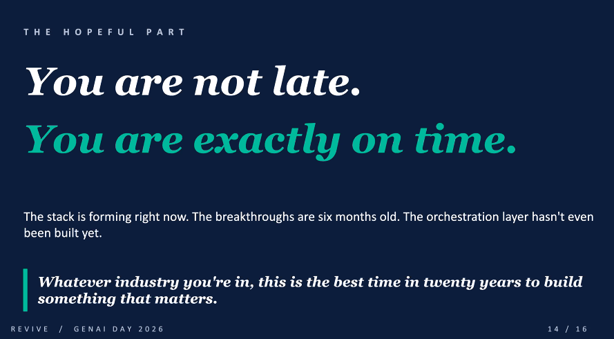
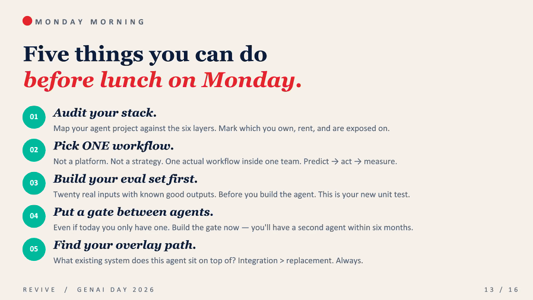
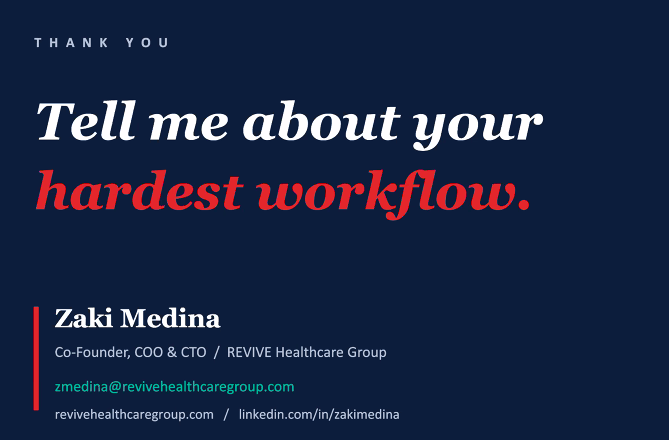

#### S12 4:00 - Zaki Medina - Follow-up

---

## LinkedIn

See [linkedin_post.md](linkedin_post.md) for the promotional post and first comment.

## After-session

In anonymous survey - <https://docs.google.com/forms/u/0/d/e/1FAIpQLSePm89aL15886Rgn7tRLLEnwEEXbd9XOJD8ZRNCDJwtJXDrWA/formResponse>

(Jess Wolfe) - Wow!  Great L1-L5 framing.  Good audience participation via chat, but without bogging down.  Nice refrain - DoD is definition of ready for AI.  Nice.  
(Alan Knox) - Listening casually, I'd say he was speaking too fast, but by paying attention it was so well-delivered that I could keep up with an amazing of insight for all the agents he mentione.  Great summary picture and restating at the end with all on one sheet.  And great summary-summary of what AI does and what humans do - AI proposes.  System (which includes people and process) decides"
(Tony Rockliff) - What a wonderful way of being.  Hyper geeky.  Hyper humane.  Type A content wrapped in a Chill-Out presence.  Highly inspiring.
(Stacy Gonyou) - Soooo many notes.  Too many side references to grab - but the name dropping added credibility and gravitas to the presentation, not merely gratuitous name-dropping theatre.  They amplified the points for how to get the promises of the 60- or 90-day goals.  Great modeling of how a limited-time engagement can reframe why "continual learning" is not just an occasional learning/doing jump but  rather a change in mind-set.
(Zaki Medina) - <Repeat Stacy comment about breadth of references adding gravitas and credibility, but not diverting attention>  I loved the zoom out to 2024 Start, 2025 Struggle, 2026 Click.  Not candy-coated platitude about perseverence, but rather the scars and lessons from slogging through uncertainty.
Sorry I couldn't just pick one!!!  These were all above expectation, not just (mathematically boringly) above the day's average.

## Links

1. [AI Essentials for Training Managers](https://trainingindustry.com/continuing-professional-development/certificates/ai-essentials-for-training-managers-optimizing-ld-with-artificial-intelligence/) -- Training Industry certificate program on applying AI in L&D functions.
2. [Book a meeting with Otto Hilska, Swarmia](https://link.swarmia.com/meetings/otto-hilska/partner?utm_campaign=genai-day-2026&uuid=e386f05c-bbde-4e0f-b2ed-01045c21cdaa) -- Partner meeting link to demo Swarmia's engineering AI adoption tracking platform.
3. [Jenny Larsson](https://www.linkedin.com/in/jlarsson/)
4. [Chris Barth](https://www.linkedin.com/in/chrisbarthsr/)
5. [Jordan Plawner](https://www.linkedin.com/in/jordan-plawner/)
6. [AI Business Summit](https://aibusinesssummit.com/optin-page---ga?fpr=abundance555) -- Registration opt-in for an AI-focused business summit event.
7. [Google: what is Manus in AI terms](https://www.google.com/search?q=what+is+manus+in+ai+terms&oq=what+is+manus+in+ai+terms&gs_lcrp=EgZjaHJvbWUyCQgAEEUYORigATIHCAEQIRigATIHCAIQIRigATIHCAMQIRigAdIBCDgwMzZqMGo3qAIAsAIA&sourceid=chrome&ie=UTF-8) -- Background search on the Manus AI agent platform referenced during sessions.
8. [Conway's Law](https://en.wikipedia.org/wiki/Conway%27s_law) -- Organizations design systems that mirror their internal communication structures.
9. [Agile Manifesto Principles](https://agilemanifesto.org/principles.html) -- The 12 principles behind the Agile Manifesto, frequently cited in AI adoption discussions.
10. [Lean Startup (book search)](https://www.google.com/search?q=lean+startup+book&oq=lean+startup+book&gs_lcrp=EgZjaHJvbWUyBggAEEUYOdIBCDI4MDhqMGo3qAIAsAIA&sourceid=chrome&ie=UTF-8) -- Eric Ries's methodology for iterative product development and validated learning.
11. [Manus login (invite code)](https://manus.im/login?code=W3A2QNOKWVDOD) -- Personal invite link for the Manus AI agent platform.
12. [Slido: GenAI Day #7 live polls](https://app.sli.do/event/91jMcG6HfbRub2EFuNyY7b/live/polls) -- Audience interaction polls for the event.
13. [Manus app login](https://manus.im/login?redirectUrl=https%3A%2F%2Fmanus.im%2Fapp%3FredirectUrl%3D) -- Manus login with redirect to the main app.
14. [Manus login (invite code)](https://manus.im/login?code=W3A2QNOKWVDOD) -- Duplicate of entry 11.
15. [AI Connection Club: RenderZero Studio](https://aiconnectionclub.com/renderzero-studio/) -- Tony Rockliff's AI-powered video production studio offering within the AI Connection Club.
16. [Everyone's installing AI agents, nobody's adopting them](https://thesolutiontea.substack.com/p/everyones-installing-ai-agents-nobodys) -- Substack piece on the gap between deploying AI agents and achieving real team adoption.
