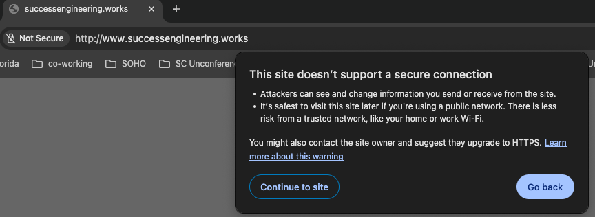

# Issue: `www.successengineering.com` shows "Not Secure" warning in Chrome

## Summary

Visitors who click the LinkedIn profile link for `successengineering.com` land on a browser
security warning instead of the website. The site works fine when reached via HTTPS, but the
LinkedIn link points to an HTTP URL, and the server is not configured to redirect HTTP traffic
to HTTPS.

---

## How to Replicate

Paste `http://www.successengineering.com` into a fresh Chrome tab (not a bookmarked HTTPS
URL, not a cached visit -- see [note on browser caching](#note-on-browser-caching) below)
and press Return. Chrome shows: **"This site doesn't support a secure connection."**

The most common trigger: the URL appears as plain text in someone's biography or profile,
is triple-clicked to select, copied, and pasted into the browser address bar. Because it
was written as plain text (not a hyperlink), it carries the literal `http://www.` prefix.



Verify the underlying behavior directly:

```bash
curl -Is http://www.successengineering.com   # returns 200 OK -- no redirect to HTTPS
curl -Is https://www.successengineering.com  # hangs -- TLS handshake succeeds, no HTTP response
curl -Is https://successengineering.com      # returns 200 OK ✓
```

All four URL forms -- including what a user types with no scheme prefix -- and their actual behavior:

| URL (as typed or copied)             | Expected                                     | Actual                                                                                  |
|--------------------------------------|----------------------------------------------|-----------------------------------------------------------------------------------------|
| `www.successengineering.com`         | Redirect to `https://successengineering.com` | Chrome tries `https://www.` first; TLS connects but no HTTP response → security warning |
| `successengineering.com`             | Redirect to `https://successengineering.com` | Chrome tries `https://successengineering.com` first → loads fine                        |
| `http://www.successengineering.com`  | Redirect to `https://successengineering.com` | 200 OK over HTTP -- no redirect issued                                                  |
| `http://successengineering.com`      | Redirect to `https://successengineering.com` | 200 OK over HTTP -- no redirect issued                                                  |
| `https://www.successengineering.com` | Redirect to `https://successengineering.com` | TLS handshake succeeds, no HTTP response                                                |
| `https://successengineering.com`     | Loads site                                   | Loads site ✓                                                                            |

### Note on browser caching

Chrome caches `301 Moved Permanently` redirects persistently -- across restarts, across
sessions. If you visited `https://successengineering.com` recently, Chrome may silently
reuse the cached redirect and never hit the broken path. To reproduce reliably:

- Use an Incognito window (Cmd-Shift-N), or
- Clear site data: **Settings → Privacy → Clear browsing data → Cached images and files**

---

## Explanation for Users

When you click a link that says `http://www.successengineering.com`, your browser recognizes
the connection is unencrypted. Modern Chrome automatically tries to upgrade it to the secure
`https://` version. For `www.successengineering.com`, that HTTPS upgrade fails -- the server
doesn't respond over HTTPS on the `www` address -- so Chrome shows the warning instead of
loading the page.

This only happens because:

- The LinkedIn profile stores the URL as `http://www.successengineering.com`
- The server is not set up to send visitors from HTTP to HTTPS automatically

The website itself works fine at `https://successengineering.com`.

---

## Explanation for the Web Administrator

Three things are misconfigured on `successengineering.com` (GoDaddy hosting):

1. **No HTTP → HTTPS redirect on the apex domain.** `http://successengineering.com`
   returns `200 OK` directly over HTTP instead of a `301 Moved Permanently` to
   `https://successengineering.com`.

2. **No HTTP → HTTPS redirect on the `www` subdomain.** `http://www.successengineering.com`
   also returns `200 OK` over HTTP with no redirect.

3. **`https://www.successengineering.com` accepts TLS but sends no HTTP response.**
   The GoDaddy cert (`CN=www.successengineering.com`) exists and the TLS handshake
   completes, but the server never sends an HTTP response body. Chrome interprets this
   as a failed HTTPS upgrade and shows the security interstitial.

Contrast with `successengineering.works`, which is configured correctly:
`http://www.successengineering.works` → `301` → `https://www.successengineering.works`
→ `301` → `https://successengineering.works` → `200 OK`.

### Verified with

```bash
# All four combinations for .com:
curl -Is http://successengineering.com       # 200 OK  (should be 301)
curl -Is http://www.successengineering.com   # 200 OK  (should be 301)
curl -Is https://successengineering.com      # 200 OK  ✓
curl -Is https://www.successengineering.com  # (no response -- hangs)

# SSL cert on www:
echo | openssl s_client -connect www.successengineering.com:443 \
  -servername www.successengineering.com 2>&1 | grep "subject="
# subject=CN=www.successengineering.com  (GoDaddy cert, TLS OK, but no HTTP served)
```

---

## Solution

### Immediate workaround (no server access needed)

Update the LinkedIn profile "Website" field to:

```text
https://successengineering.com
```

No `www.`, explicit `https://`. This bypasses all redirect issues for visitors coming
from LinkedIn.

### Identify the server

The `successengineering.com` hosting suppresses the `Server:` response header, so the
server type cannot be confirmed remotely. Determine it on the host:

```bash
# If you have SSH access:
nginx -v 2>&1 || apache2 -v 2>&1 || httpd -v 2>&1
```

### Permanent fix -- Apache `.htaccess`

Drop this into the document root `.htaccess` (works on shared GoDaddy hosting without
SSH, via cPanel File Manager or SFTP):

```apache
RewriteEngine On

# Redirect all HTTP and all www → canonical HTTPS apex
RewriteCond %{HTTPS} off [OR]
RewriteCond %{HTTP_HOST} ^www\. [NC]
RewriteRule ^ https://successengineering.com%{REQUEST_URI} [L,R=301]
```

### Permanent fix -- nginx

The server config suppresses its identity header, so confirm nginx is running before
applying. Add two `server` blocks -- one for HTTP (both names), one for HTTPS `www`:

```nginx
# Redirect all HTTP traffic on apex and www → HTTPS apex
server {
    listen 80;
    server_name successengineering.com www.successengineering.com;
    return 301 https://successengineering.com$request_uri;
}

# Redirect https://www → https://apex (requires the existing GoDaddy cert)
server {
    listen 443 ssl;
    server_name www.successengineering.com;
    ssl_certificate     /path/to/www.successengineering.com.crt;
    ssl_certificate_key /path/to/www.successengineering.com.key;
    return 301 https://successengineering.com$request_uri;
}
```

Reload after editing:

```bash
nginx -t && systemctl reload nginx
```

### Optional: HSTS (after redirects are confirmed working)

Eliminates the HTTP round-trip entirely -- browsers remember to always use HTTPS:

```nginx
# Inside the https://successengineering.com server block:
add_header Strict-Transport-Security "max-age=31536000; includeSubDomains" always;
```

```apache
# In .htaccess, after the RewriteRules:
Header always set Strict-Transport-Security "max-age=31536000; includeSubDomains"
```

---

## Modern URL typography: drop `www.`

The `www.` subdomain is the direct cause of the broken link in this issue. It also signals
outdated web practice and should be removed from all materials.

### Why `www.` is no longer needed

- **Users don't type it.** No one writes `www.` when entering a URL by hand anymore.
- **Browsers suppress it.** Chrome, Firefox, and Safari all hide `www.` in the address bar
  when it's present, because they consider it noise -- not information.
- **It was a convention, not a requirement.** In the early web, `www` distinguished a web
  server from `ftp.`, `mail.`, `gopher.`, etc. on the same domain. Those other services are
  gone. The distinction is meaningless.
- **It creates avoidable failure modes.** As this issue demonstrates, `www.successengineering.com`
  and `successengineering.com` can be misconfigured independently, and the `www` variant is
  the one that breaks.

### What to use instead

In all printed, digital, and verbal materials, use the bare domain:

```text
successengineering.com
```

Do not prefix with `http://`, `https://`, or `www.`. The scheme is infrastructure, not
branding -- browsers handle it invisibly. Printing it is the URL equivalent of writing out
your phone number as `tel:+1-555-1234`.

---

## Verified behavior after fix

Once configured, all four entry points should resolve to `https://successengineering.com`:

```text
http://successengineering.com      → 301 → https://successengineering.com ✓
http://www.successengineering.com  → 301 → https://successengineering.com ✓
https://www.successengineering.com → 301 → https://successengineering.com ✓
https://successengineering.com     → 200 ✓
```
